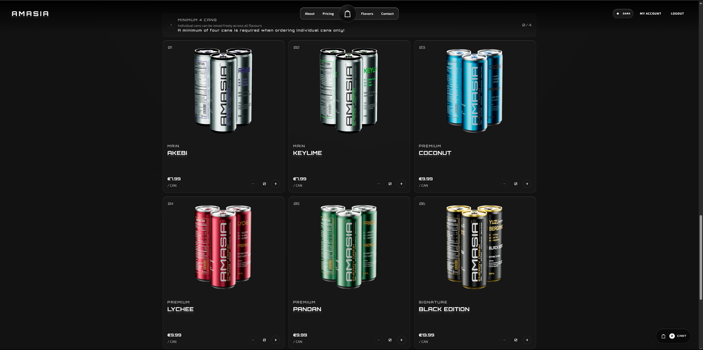
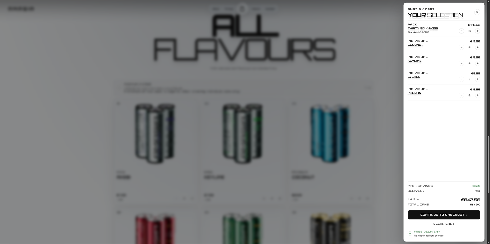
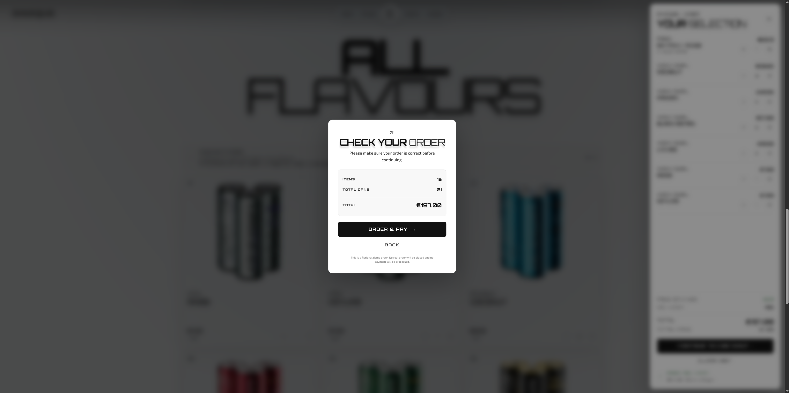
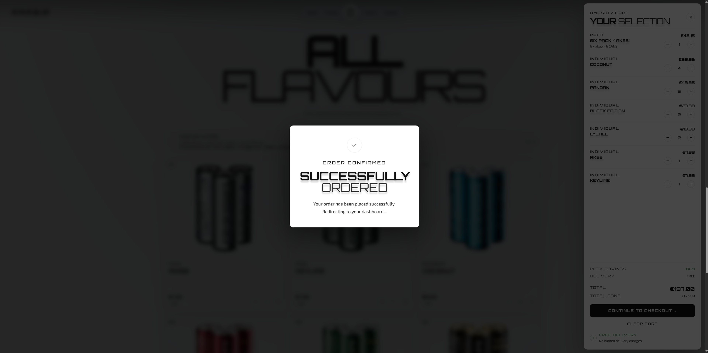
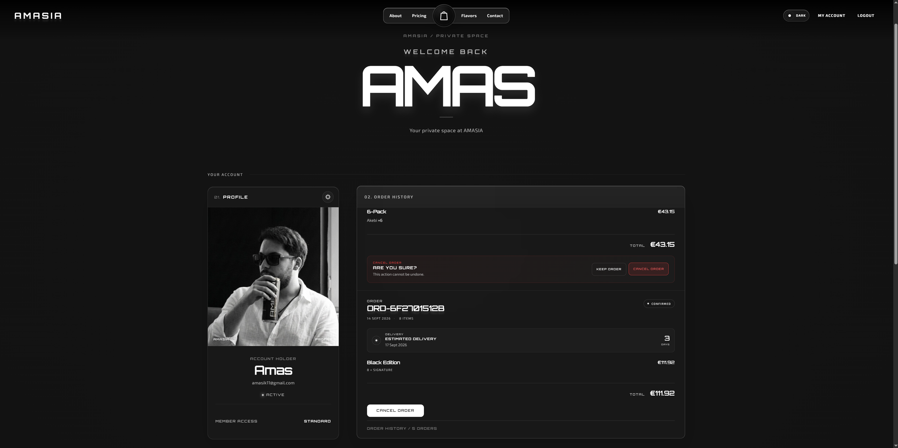
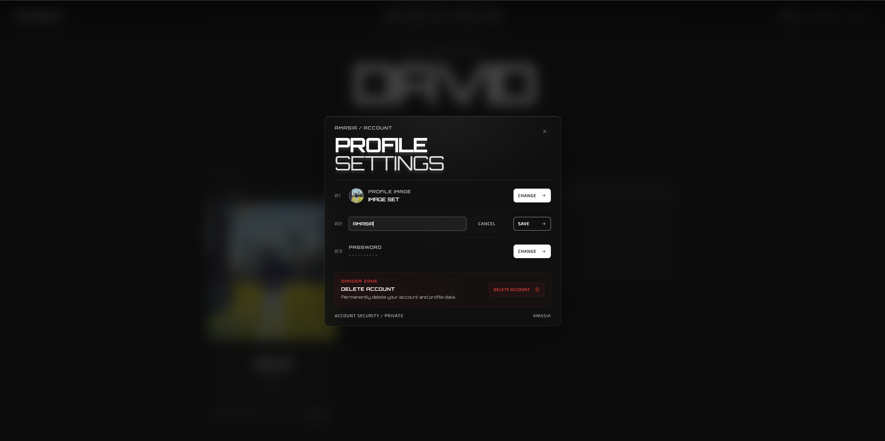
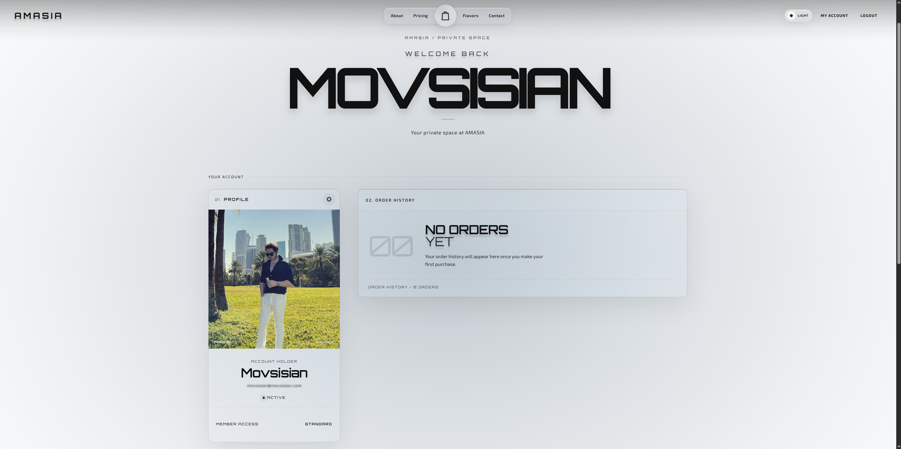
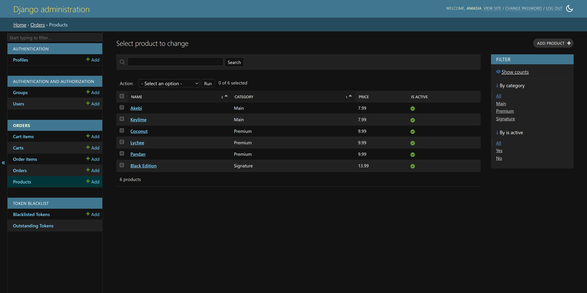

# AMASIA Backend

A production ready oriented REST API powering the AMASIA interactive 3D energy drink experience. Built with Django and Django REST Framework, this backend delivers JWT authentication, a complete cart and checkout pipeline, pack composition rules, order history, and account management for a premium e commerce flow.

The API is designed around a clean modular architecture that separates authentication from order handling, keeps business rules inside dedicated service logic, and exposes a predictable endpoint surface that the Angular frontend can consume directly.

The backend is deployed on an Ubuntu Linux server using Nginx and Gunicorn, while the Angular frontend is hosted on GitHub Pages.

---

## Preview

| Shop and Product Catalog | Cart with Live Savings |
| :---: | :---: |
|  |  |

| Checkout Confirmation | Order Confirmed |
| :---: | :---: |
|  |  |

| Order History | Profile Settings |
| :---: | :---: |
|  |  |

| Empty Order History | Django Admin |
| :---: | :---: |
|  |  |

---

## Overview

AMASIA is a fictional premium energy drink brand presented through an immersive 3D web experience. This repository contains the backend that supports user accounts and the full ordering lifecycle behind that experience.

The backend handles:

- User registration and authentication using JSON Web Tokens
- Case insensitive usernames and unique email enforcement
- Profile management including profile image upload
- Password changes and full account deletion
- Product catalog access
- Shopping cart with individual cans and discounted packs
- Pack composition validation with strict business rules
- Checkout that converts a cart into a permanent order
- Order history with automatic delivery status after three days
- Order cancellation with delivery awareness

The ordering flow is intentionally realistic but simulated. No payment provider is involved, which makes it a safe and complete demonstration of a real e commerce backend.

---

## Key Features

- **JWT Authentication:** Secure access and refresh token flow using SimpleJWT with token rotation and blacklisting after rotation.
- **Case Insensitive Login:** Usernames are matched regardless of letter casing, while the original casing is preserved.
- **Unique Email Enforcement:** Each email address can only be registered once, validated case insensitively.
- **Profile Image Upload:** Users can add or replace a profile image through multipart form data.
- **Account Lifecycle:** Register, log in, log out, update profile, change password, and delete the account.
- **Product Catalog:** Active products exposed by category, covering Main, Premium, and Signature lines.
- **Smart Cart:** Supports individual cans and packs with separate quantity handling.
- **Pack Composition Rules:** Packs enforce category consistency and valid flavor splits before they reach the cart.
- **Automatic Discounts:** Packs receive a ten percent discount calculated at the moment of adding.
- **Cart Limits:** A global maximum of nine hundred drinks per order, with per size pack limits.
- **Checkout Pipeline:** Atomic transaction that converts the cart into an order and clears the cart.
- **Order History:** Full order list and detail views scoped to the authenticated user only.
- **Simulated Delivery:** Orders are marked as delivered automatically three days after creation.
- **Order Cancellation:** Cancellation is blocked once an order has been delivered.
- **Atomic Operations:** Critical write paths are wrapped in database transactions for consistency.

---

## Tech Stack

- **Framework:** Django
- **API Layer:** Django REST Framework
- **Authentication:** djangorestframework simplejwt with token blacklist
- **Database:** SQLite for development
- **Cross Origin:** django cors headers
- **Configuration:** python dotenv for environment variables
- **Media Handling:** Django media storage for product and profile images
- **Password Security:** Django built in password validators

---

## Deployment

The backend runs in production on an Ubuntu Linux server. Nginx acts as the reverse proxy and Gunicorn serves the Django application behind it.
The frontend of the AMASIA experience is hosted separately on GitHub Pages and communicates with this backend over the deployed API.

Deployment outline:

- Ubuntu Linux server hosting the Django application
- Gunicorn as the WSGI application server
- Nginx as the reverse proxy and static file server
- Environment variables managed through a `.env` file on the server
- Frontend hosted on GitHub Pages, consuming the deployed API

---

## Installation

### Prerequisites

- Python 3.10 or higher
- pip
- A virtual environment tool such as venv

### Getting Started

**1. Clone the repository**

```bash
git clone https://github.com/AmasMovsisian/AmasiaInteractive3D.git
cd AmasiaInteractive3D/backend
```

**2. Create and activate a virtual environment**

```bash
python -m venv venv
source venv/bin/activate
```

On Windows use:

```bash
venv\Scripts\activate
```

**3. Install dependencies**

```bash
pip install -r requirements.txt
```

**4. Configure environment variables**

Create a `.env` file in the backend root with the following values:

```env
SECRET_KEY=your_secret_key_here
DEBUG=True
ALLOWED_HOSTS=localhost,127.0.0.1
CORS_ALLOWED_ORIGINS=http://localhost:4200
CSRF_TRUSTED_ORIGINS=http://localhost:4200
```

**5. Apply migrations**

```bash
python manage.py migrate
```

**6. Create an admin user (optional)**

```bash
python manage.py createsuperuser
```

**7. Run the development server**

```bash
python manage.py runserver
```

The API will be available at:

```text
http://localhost:8000/
```

---

## Environment Variables

| Variable | Description |
| :--- | :--- |
| `SECRET_KEY` | Django secret key, required at startup |
| `DEBUG` | Enables debug mode when set to True, 1, or yes |
| `ALLOWED_HOSTS` | Comma separated list of allowed hosts |
| `CORS_ALLOWED_ORIGINS` | Comma separated list of allowed frontend origins |
| `CSRF_TRUSTED_ORIGINS` | Comma separated list of trusted CSRF origins |

When `DEBUG` is disabled, the project automatically enables SSL redirect, secure cookies, HSTS, content type sniffing protection, and a strict referrer policy.

---

## Project Structure

A modular layout that separates authentication, order logic, and core configuration.

```text
backend/
├── authentication/
│   ├── api/
│   │   ├── serializers.py     # Registration, login, profile, password serializers
│   │   ├── views.py           # Auth endpoints
│   │   └── urls.py            # Auth routing
│   ├── migrations/
│   └── models.py              # Profile model linked to User
│
├── core/
│   ├── settings.py            # Project configuration
│   ├── urls.py                # Root URL configuration
│   └── wsgi.py
│
├── orders/
│   ├── api/
│   │   ├── serializers.py     # Product, cart, and order serializers
│   │   ├── views.py           # Cart, checkout, and order endpoints
│   │   └── urls.py            # Order routing
│   ├── migrations/
│   └── models.py              # Product, Cart, Order and related models
│
├── media/
│   └── profile_images/        # Uploaded profile images
│
├── staticfiles/
│
├── manage.py
├── requirements.txt
├── .env
└── .gitignore
```

---

## Authentication

Authentication uses JSON Web Tokens issued by SimpleJWT.

- Access tokens expire after ten minutes.
- Refresh tokens expire after one day.
- Refresh tokens rotate on use.
- Rotated refresh tokens are blacklisted.
- The auth header type is Bearer.

To access protected endpoints, include the access token in the request header:

```text
Authorization: Bearer <access_token>
```

### Authentication Endpoints

| Method | Endpoint | Description |
| :--- | :--- | :--- |
| POST | `/api/auth/register/` | Register a new user |
| POST | `/api/auth/login/` | Log in and receive access and refresh tokens |
| POST | `/api/auth/refresh/` | Refresh the access token using a refresh token |
| GET | `/api/auth/me/` | Get the current authenticated user |
| PATCH | `/api/auth/me/` | Update username, email, or profile image |
| POST | `/api/auth/change-password/` | Change the current user password |
| DELETE | `/api/auth/delete-account/` | Delete the current user account |
| POST | `/api/auth/logout/` | Blacklist the provided refresh token |

---

## Orders and Checkout

The order system models a realistic purchase flow with individual cans and bundled packs.

### Individual Items

Individual cart items represent single cans. The quantity can be updated directly, and an individual order requires a minimum of four drinks in total.

### Packs

Packs are bundled orders with a fixed size of six, twelve, or thirty six drinks. Packs receive a ten percent discount on the summed base price at the time they are added.

Pack rules:

- All products in a pack must belong to the same category.
- A pack can contain one flavor or two flavors split fifty fifty.
- Six packs cannot be split between two flavors.
- Signature packs can contain only one flavor in the full pack quantity.
- A pack must contain exactly its size in total drinks.
- The same flavor cannot appear twice in a single pack.

Pack quantity cannot be edited after it is added. The pack must be removed and a new one created instead.

### Limits

- Maximum total units per order is nine hundred drinks.
- Maximum of one hundred fifty six packs.
- Maximum of seventy five twelve packs.
- Maximum of twenty five thirty six packs.

### Delivery Simulation

Every order is created with a Confirmed status. After three days from creation the order is automatically reported as Delivered through the serializer. Cancellation is only allowed while the order is still Confirmed and not yet delivered.

### Order Endpoints

| Method | Endpoint | Description |
| :--- | :--- | :--- |
| GET | `/api/orders/products/` | List all active products |
| GET | `/api/orders/products/<id>/` | Get a single active product |
| GET | `/api/orders/cart/` | Get the current user cart |
| POST | `/api/orders/cart/add/` | Add an individual product or a pack to the cart |
| PATCH | `/api/orders/cart/items/<id>/` | Update the quantity of a cart item |
| DELETE | `/api/orders/cart/items/<id>/remove/` | Remove a cart item |
| POST | `/api/orders/checkout/` | Convert the cart into an order |
| GET | `/api/orders/` | List all orders of the current user |
| GET | `/api/orders/<id>/` | Get a single order of the current user |
| POST | `/api/orders/<id>/cancel/` | Cancel an order if it is still cancellable |

---

## Security Notes

- Passwords are validated using Django built in validators covering similarity, minimum length, common passwords, and numeric only passwords.
- Access tokens are short lived at ten minutes.
- Refresh tokens rotate and are blacklisted after rotation.
- Account deletion uses an atomic transaction.
- Checkout uses an atomic transaction to prevent partial order creation.
- Production mode enforces HTTPS, secure cookies, and HSTS.

---

## About the Creator

This backend is part of a solo production project that spans brand identity, 3D modeling, texturing, frontend architecture, and now a complete API layer.
It demonstrates that design, art, and code are not separate disciplines, but parts of a single workflow.

### Author

**Amas Movsisian**