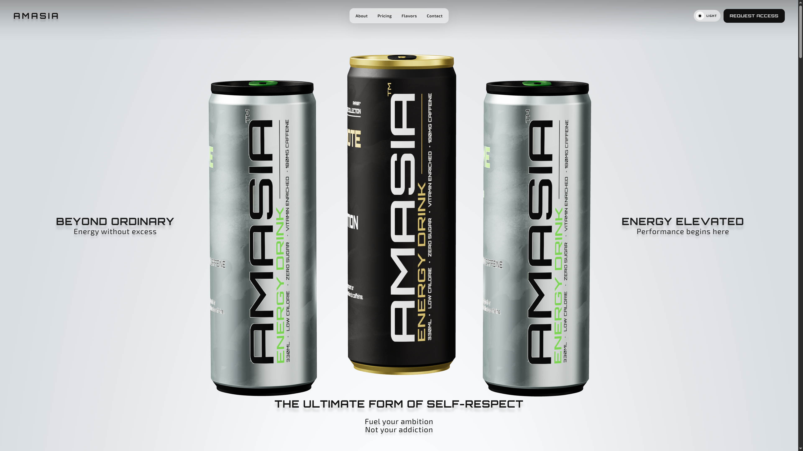
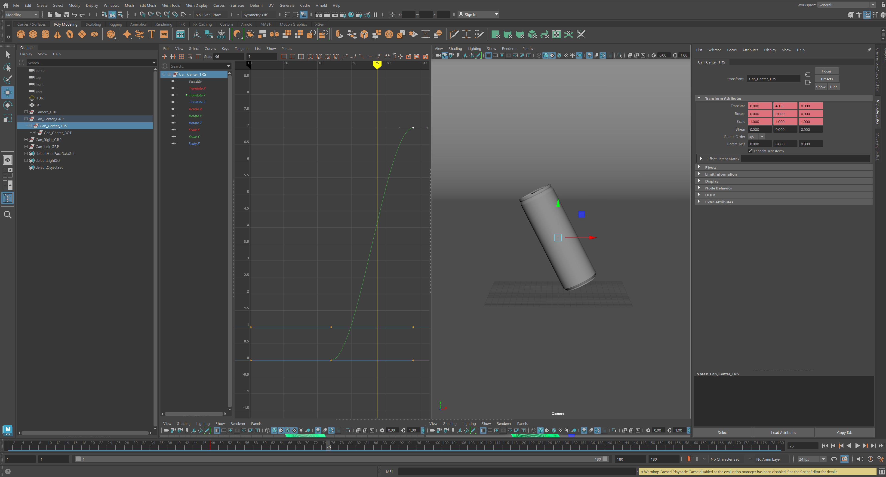
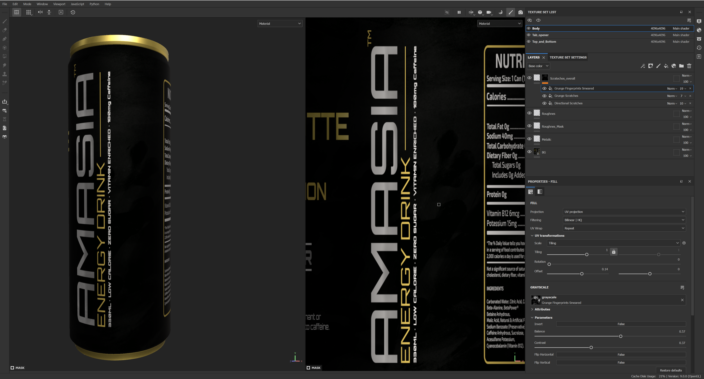
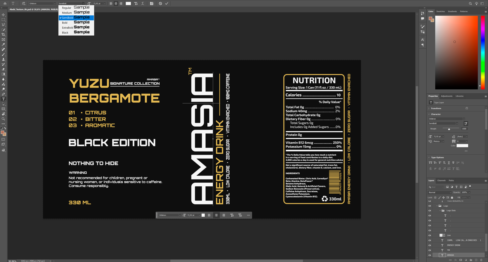
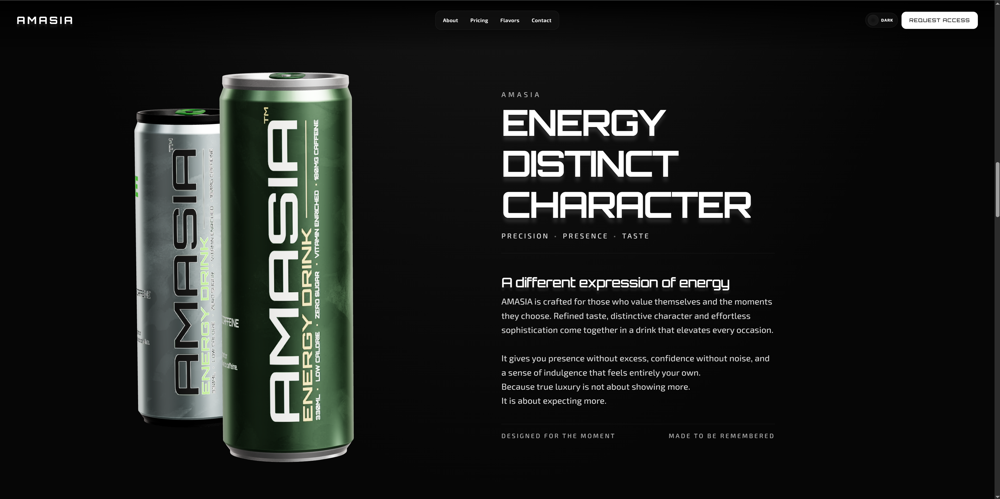

 
# Interactive 3D Luxury Energy Experience



## The Intersection of Art, Design, 3D and Code

AMASIA is a fully self produced digital experience for a premium energy drink brand, created from the first concept sketch to the final line of TypeScript.

Every part of the project was developed as one continuous workflow: **brand identity, UI/UX, 3D modeling, PBR texturing, animation, rendering, frontend architecture, and WebGL performance optimization.**

The result is an immersive 3D product experience built with **Angular 20 and Three.js**, combining high end visual design with a performance focused web pipeline. Rather than treating design, 3D, and development as separate disciplines, AMASIA brings them together into a single end to end production process.

---

## Key Features

- **Immersive 3D Interaction:** Interactive cans featuring fluid 360° rotation, dynamic flavor switching, and cinematic camera transitions, built with Angular 20 and Three.js.
- **Exclusive Branding & UI/UX:** A fully custom design language with a minimalist luxury aesthetic, seamless Dark/Light mode, and custom typography (Orbitron, Exo 2, League Spartan).
- **Ultra Fast Loading (KTX2 Optimization):** High fidelity textures carefully optimized from **113 MB+ down to 5.67 MB** using **KTX2/Basis Universal** compression. This ensures photorealistic quality with an incredibly fast load time and smooth performance across all devices.
- **Responsive & Adaptive:** Fully optimized for desktop, tablet, and mobile with touch driven 3D interactions.

---

## Design & Art Direction

Every aspect of the visual identity was designed and produced from the ground up:

- **Concept & Branding:** Custom logo, premium color palettes, and a compelling brand voice ("Energy without excess. Not your addiction.").
- **Label & UI Layout:** The entire can design and visual layout was crafted in **Adobe Photoshop**.
- **PBR Texturing:** The initial assets were refined into true PBR materials with real metallic and roughness maps in **Adobe Substance Painter**.
- **3D Modeling & Export:** High poly product modeling was created in **Autodesk Maya**. The final animation and optimized GLB export for Three.js was handled in **Houdini** (including the Redshift renders for the upcoming flavors).

### 3D Pipeline Preview

| **Autodesk Maya** | **Adobe Substance Painter** |
| :---: | :---: |
|  |  |

| **Adobe Photoshop** | **Final Web Result** |
| :---: | :---: |
|  |  |

---

## Tech Stack & Pipelines

### Web Development

- **Framework:** Angular 20 (TypeScript, SCSS)
- **3D Engine:** Three.js (WebGL, GLTFLoader, KTX2Loader, EXRLoader)
- **Data & State:** Custom Angular Services (Flavor, Responsive, Scroll)
- **Rendering Optimizations:** KTX2 & Basis Universal compression, custom Arnold Lighting JSON conversion for WebGL

### 3D & Design Pipeline

- **Autodesk Maya:** High fidelity 3D modeling of the cans.
- **Adobe Photoshop:** Custom label design, UI layout, and final post processing.
- **Adobe Substance Painter:** PBR texture refinement (Base Color, Metallic, Roughness).
- **Houdini:** Procedural detailing, animation, GLB export for Three.js, and Redshift rendering.

---

## Installation

### Prerequisites

To run this project, you need the following global tools installed on your machine:

- [Node.js](https://nodejs.org/) (Version 18 or higher)
- [Angular CLI](https://angular.dev/tools/cli) (Version 20)

> **Note:** This project uses advanced 3D technologies like **Three.js**, **KTX2 compression**, **EXR lighting**, and **GLTF models**. All necessary libraries and optimized assets are already configured and included in the project. A simple `npm install` handles everything automatically. No additional manual setup is required.

### Getting Started

**1. Clone the Repository**
```bash
git clone https://github.com/AmasMovsisian/AmasiaInteractive3D.git
cd AmasiaInteractive3D/frontend

2. Install dependencies (Includes Three.js, KTX2 Loader, etc.)
npm install

3. Start the development server
ng serve

4. Open in browser
http://localhost:4200

```


## Project Structure

A modular architecture separating UI components from the custom 3D engine:

```text
src/
├── app/
│   ├── core/            # Business Logic & Services
│   │   └── services/    # Flavor, Responsive, Hero-Nav, Scroll
│   ├── pages/           # Route-based Components (Flavors, Contact, etc.)
│   ├── sections/        # Reusable Layout Sections (Hero, Footer, Nav)
│   └── three/           # Custom Three.js Core
│       ├── core/        # Three-Engine Logic
│       ├── lighting/    # Arnold Lighting Converter
│       ├── loaders/     # GLTF Loading
│       └── materials/   # Texture Manager
└── styles/              # Theme (Dark/Light), Fonts, Reset

public/
├── fonts/               # Custom Typography (Orbitron, Exo 2, League Spartan)
├── new-flavors/         # Upcoming Flavor Renders (Canistel, Kiwano, Salak)
└── three/               # Optimized 3D Assets
    ├── basis/           # Basis Universal Transcoder (WASM)
    ├── hdri/            # Lighting HDRI
    ├── lighting/        # Arnold Lighting JSON
    ├── materials/       # Compressed KTX2 Textures (BaseColor, Metallic, Roughness)
    └── models/          # 3D Meshes (.glb)
    
```

# About the Creator

This project is a **solo production**. It demonstrates a complete end to end workflow, from 3D modeling (Maya, Houdini) and high end texturing (Substance Painter, Photoshop) to complex frontend architecture and performance optimization (Angular 20 + Three.js + KTX2 compression).

Built for the portfolio to demonstrate that design, art, and code are not separate disciplines, but parts of a single workflow.

### Author

**Amas Movsisian**
