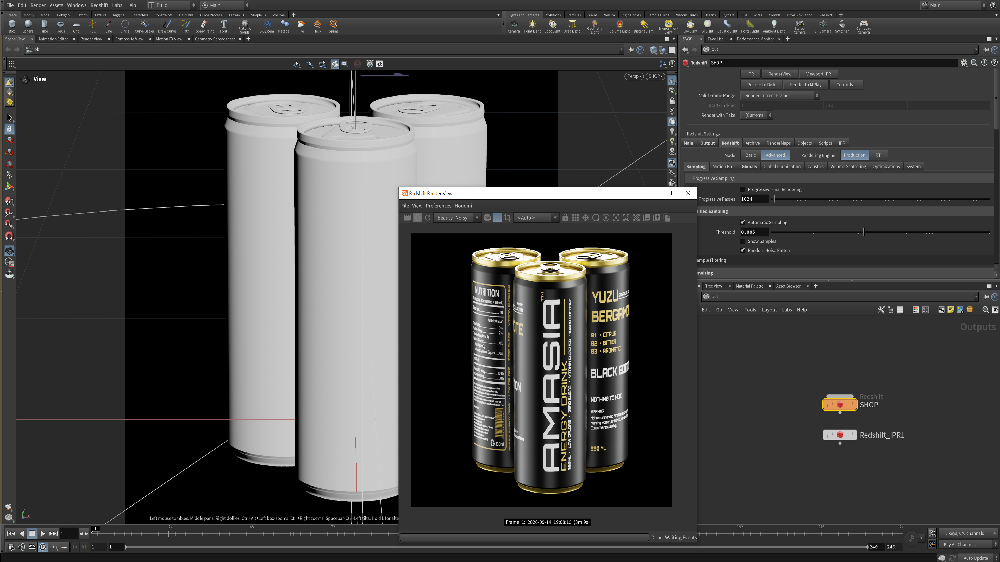
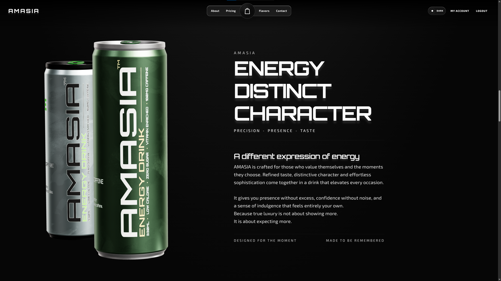
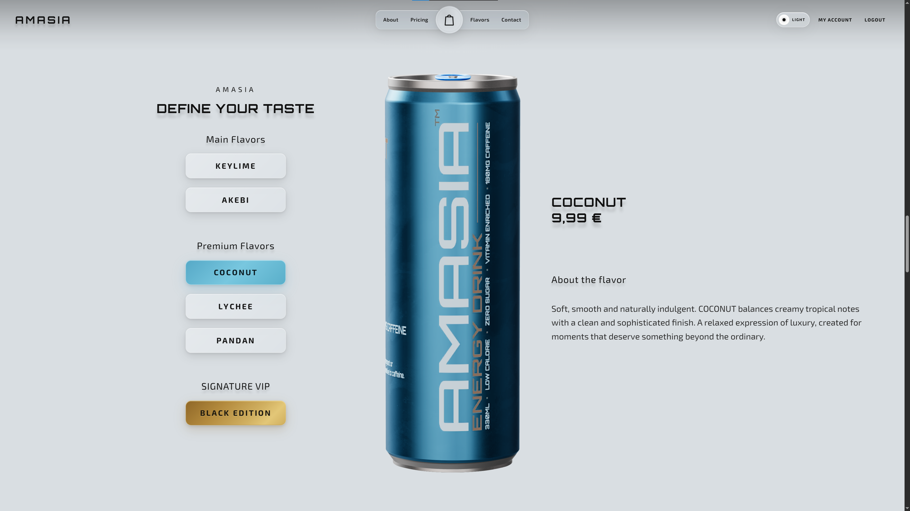
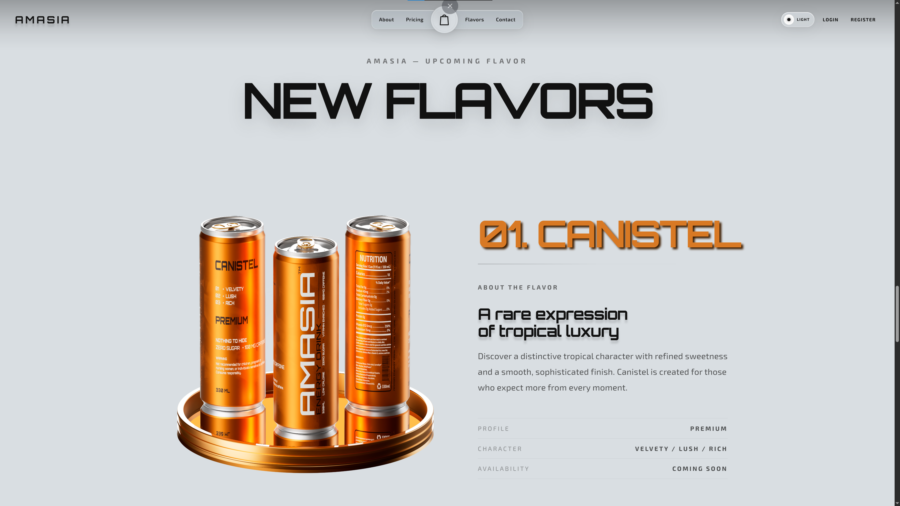
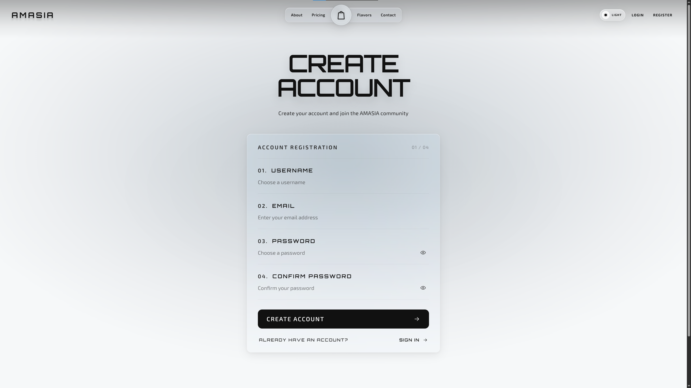
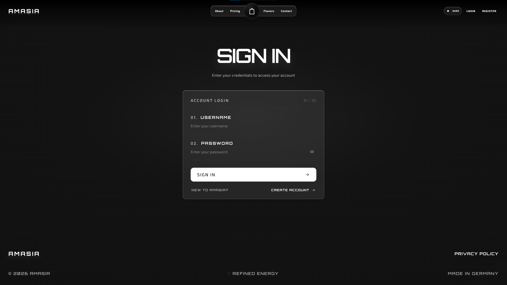
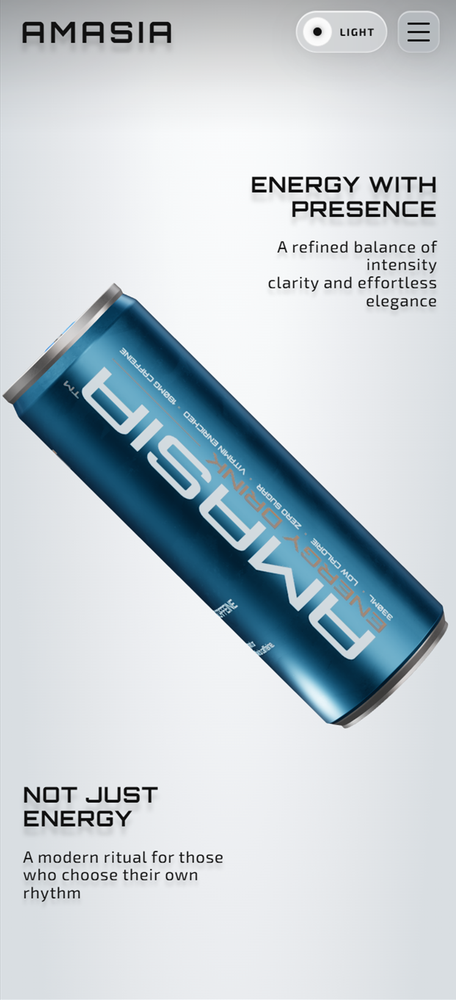
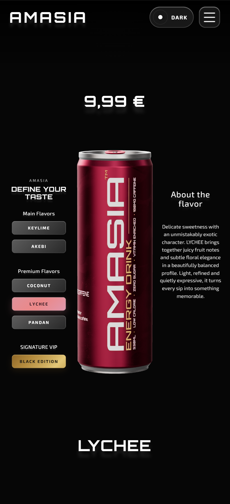
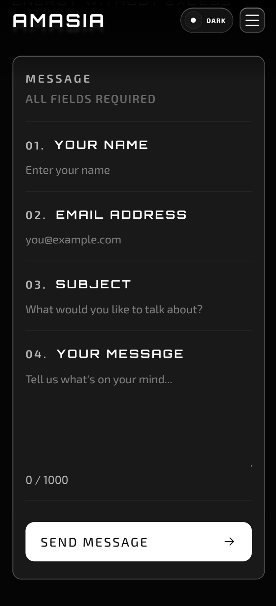
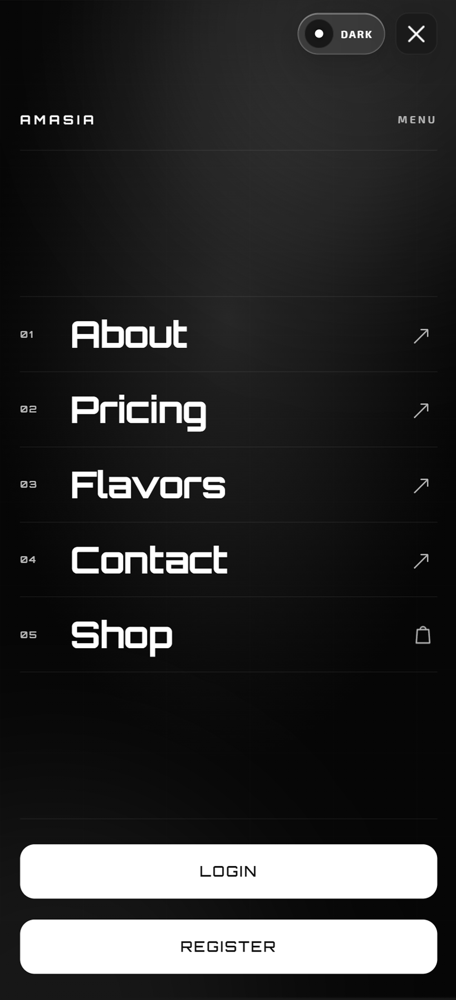

# AMASIA Frontend

# Interactive 3D Luxury Energy Experience


## The Intersection of Art, Design, 3D and Code

AMASIA is a fully self produced digital experience for a premium energy drink brand, created from the first concept sketch to the final line of TypeScript.

Every part of the project was developed as one continuous workflow: **brand identity, UI/UX, 3D modeling, PBR texturing, animation, rendering, frontend architecture, and WebGL performance optimization.**

The result is an immersive 3D product experience built with **Angular 20 and Three.js**, combining high end visual design with a performance focused web pipeline. Rather than treating design, 3D, and development as separate disciplines, AMASIA brings them together into a single end to end production process.

The frontend is hosted on GitHub Pages and communicates with a dedicated Django REST API backend that handles authentication, cart, checkout, and order history. See the backend repository below for the full API reference.

---

## Key Features

- **Immersive 3D Interaction:** Interactive cans featuring fluid 360° rotation, dynamic flavor switching, and cinematic camera transitions, built with Angular 20 and Three.js.
- **Exclusive Branding & UI/UX:** A fully custom design language with a minimalist luxury aesthetic, seamless Dark/Light mode, and custom typography (Orbitron, Exo 2, League Spartan).
- **Ultra Fast Loading (KTX2 Optimization):** High fidelity textures carefully optimized from **113 MB+ down to 5.67 MB** using **KTX2/Basis Universal** compression. This ensures photorealistic quality with an incredibly fast load time and smooth performance across all devices.
- **Responsive & Adaptive:** Fully optimized for desktop, tablet, and mobile with touch driven 3D interactions.
- **Full Stack Integration:** Registration, login, cart, checkout, and order history connected to a live Django REST API with JWT authentication.
- **Complete Order Pipeline:** Individual cans, discounted packs, pack composition rules, cart limits, and a simulated delivery status after three days.
- **Account Dashboard:** Profile card, profile settings dialog, image crop modal, and a full order history view with cancel and delivery status.

---

## Design & Art Direction

Every aspect of the visual identity was designed and produced from the ground up:

- **Concept & Branding:** Custom logo, premium color palettes, and a compelling brand voice ("Energy without excess. Not your addiction.").
- **Label & UI Layout:** The entire can design and visual layout was crafted in **Adobe Photoshop**.
- **PBR Texturing:** The initial assets were refined into true PBR materials with real metallic and roughness maps in **Adobe Substance Painter**.
- **3D Modeling & Export:** High poly product modeling was created in **Autodesk Maya**. The final animation and optimized GLB export for Three.js was handled in **Houdini** (including the Redshift renders for the upcoming flavors).

### 3D Production Pipeline

<table>
  <tr>
    <td align="center" width="50%">
      
      <br /><sub><b>Autodesk Maya</b><br/>High fidelity 3D modeling</sub>
    </td>
    <td align="center" width="50%">
      
      <br /><sub><b>Adobe Substance Painter</b><br/>PBR texturing</sub>
    </td>
  </tr>
  <tr>
    <td align="center" width="50%">
      
      <br /><sub><b>Adobe Photoshop</b><br/>Label & UI design</sub>
    </td>
    <td align="center" width="50%">
      
      <br /><sub><b>Houdini</b><br/>GLB export & Redshift rendering</sub>
    </td>
  </tr>
</table>

---

## Web Result

<table>
  <tr>
    <td align="center" width="50%">
      
      <br /><sub><b>Hero</b></sub>
    </td>
    <td align="center" width="50%">
      
      <br /><sub><b>About</b></sub>
    </td>
  </tr>
  <tr>
    <td align="center" width="50%">
      
      <br /><sub><b>Flavor & Price</b></sub>
    </td>
    <td align="center" width="50%">
      
      <br /><sub><b>New Flavors</b></sub>
    </td>
  </tr>
  <tr>
    <td align="center" width="50%">
      
      <br /><sub><b>Registration</b></sub>
    </td>
    <td align="center" width="50%">
      
      <br /><sub><b>Sign In</b></sub>
    </td>
  </tr>
</table>

---

## Mobile Responsiveness

<table>
  <tr>
    <td align="center" width="25%">
      
      <br /><sub><b>Hero</b></sub>
    </td>
    <td align="center" width="25%">
      
      <br /><sub><b>Flavor & Price</b></sub>
    </td>
    <td align="center" width="25%">
      
      <br /><sub><b>Contact</b></sub>
    </td>
    <td align="center" width="25%">
      
      <br /><sub><b>Hamburger Menu</b></sub>
    </td>
  </tr>
</table>

---

## Tech Stack & Pipelines

### Web Development

- **Framework:** Angular 20 (TypeScript, SCSS)
- **3D Engine:** Three.js (WebGL, GLTFLoader, KTX2Loader, EXRLoader)
- **Data & State:** Custom Angular Services (Flavor, Responsive, Scroll, Auth, Orders)
- **Rendering Optimizations:** KTX2 & Basis Universal compression, custom Arnold Lighting JSON conversion for WebGL

### 3D & Design Pipeline

- **Autodesk Maya:** High fidelity 3D modeling of the cans.
- **Adobe Photoshop:** Custom label design, UI layout, and final post processing.
- **Adobe Substance Painter:** PBR texture refinement (Base Color, Metallic, Roughness).
- **Houdini:** Procedural detailing, animation, GLB export for Three.js, and Redshift rendering.

---

## Installation

### Prerequisites

To run this project, you need the following global tools installed on your machine:

- [Node.js](https://nodejs.org/) (Version 18 or higher)
- [Angular CLI](https://angular.dev/tools/cli) (Version 20)

> **Note:** This project uses advanced 3D technologies like **Three.js**, **KTX2 compression**, **EXR lighting**, and **GLTF models**. All necessary libraries and optimized assets are already configured and included in the project. A simple `npm install` handles everything automatically. No additional manual setup is required.

### Getting Started

**1. Clone the Repository**

```bash
git clone https://github.com/AmasMovsisian/AmasiaInteractive3D.git
cd AmasiaInteractive3D/frontend
```

**2. Install dependencies (Includes Three.js, KTX2 Loader, etc.)**

```bash
npm install
```

**3. Start the development server**

```bash
ng serve
```

**4. Open in browser**

```text
http://localhost:4200
```

---

## Project Structure

A modular architecture separating UI components, backend services, and the custom 3D engine.

```text
frontend/
├── public/
│   ├── fonts/
│   │   ├── Exo_2/
│   │   ├── League_Spartan/
│   │   └── Orbitron/
│   ├── icons/
│   ├── new-flavors/
│   ├── shop-images/
│   └── three/
│       ├── basis/                 # Basis Universal Transcoder (WASM)
│       ├── hdri/                  # Lighting HDRI
│       ├── lighting/              # Arnold Lighting JSON
│       ├── materials/             # Compressed KTX2 Textures per flavor
│       │   ├── Akebi/
│       │   │   ├── Body_Texture_Main/
│       │   │   ├── Opening_Tab_Aluminium/
│       │   │   └── Top_Bottom_Aluminium/
│       │   ├── BlackEdition/
│       │   ├── Coconut/
│       │   ├── Keylime/
│       │   ├── Lychee/
│       │   └── Pandan/
│       └── models/                # 3D Meshes (.glb)
│
└── src/
    ├── app/
    │   ├── core/
    │   │   └── services/
    │   │       └── backend/
    │   │           ├── authentication/
    │   │           │   └── models/       # User, Profile, Token models
    │   │           └── orders/
    │   │                                 # Product, Cart, Order services and models
    │   ├── pages/
    │   │   ├── backend/
    │   │   │   ├── dashboard/
    │   │   │   │   └── components/
    │   │   │   │       ├── image-crop-modal/
    │   │   │   │       ├── orders-card/
    │   │   │   │       ├── profile-card/
    │   │   │   │       └── profile-settings-dialog/
    │   │   │   ├── login/
    │   │   │   ├── register/
    │   │   │   └── shop/
    │   │   │       ├── components/
    │   │   │       │   ├── cart-dialog/
    │   │   │       │   ├── individual-cans/
    │   │   │       │   └── pack-builder/
    │   │   │       └── models/
    │   │   ├── coming-soon/
    │   │   ├── contact/
    │   │   ├── flavors/
    │   │   └── new-flavors/
    │   ├── sections/
    │   │   ├── hero/
    │   │   ├── scroll-story/
    │   │   │   └── story/
    │   │   └── shared/
    │   │       ├── footer/
    │   │       ├── nav/
    │   │       ├── not-found/
    │   │       └── privacy-policy/
    │   └── three/
    │       ├── core/                # Three-Engine Logic
    │       ├── lighting/            # Arnold Lighting Converter
    │       ├── loaders/             # GLTF Loading
    │       └── materials/           # Texture Manager
    ├── environments/
    └── styles/                      # Theme (Dark/Light), Fonts, Reset
```

---

## Roadmap

**Completed:**

- Full 3D interactive frontend with Angular 20 and Three.js
- KTX2 compressed texture pipeline and fast load times
- Django REST API backend with JWT authentication
- Cart, pack composition, checkout, and order history
- Dashboard with profile card, settings dialog, and order management
- Client side image cropping for profile uploads

---

## About the Creator

This project is a **solo production**. It demonstrates a complete end to end workflow, from 3D modeling (Maya, Houdini) and high end texturing (Substance Painter, Photoshop) to complex frontend architecture and performance optimization (Angular 20 + Three.js + KTX2 compression), and now a full Django REST API backend with a full ordering pipeline.

Built for the portfolio to demonstrate that design, art, and code are not separate disciplines, but parts of a single workflow.

### Author

**Amas Movsisian**